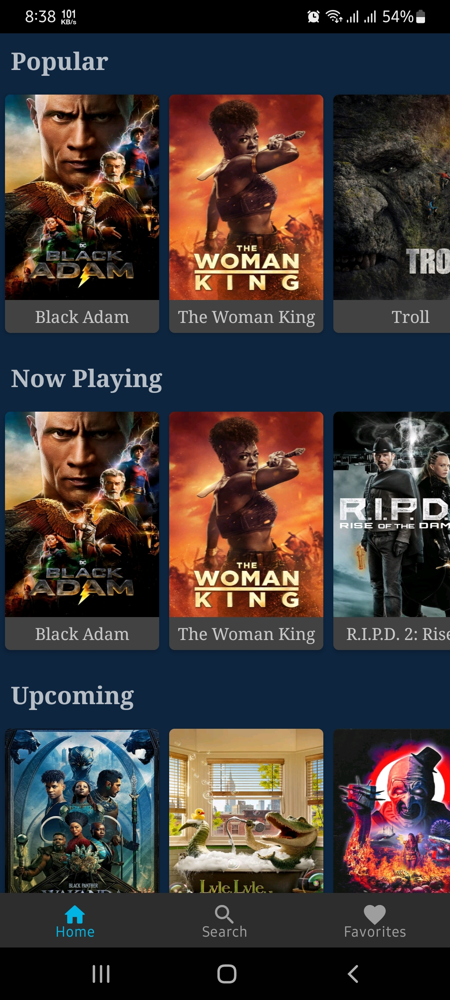
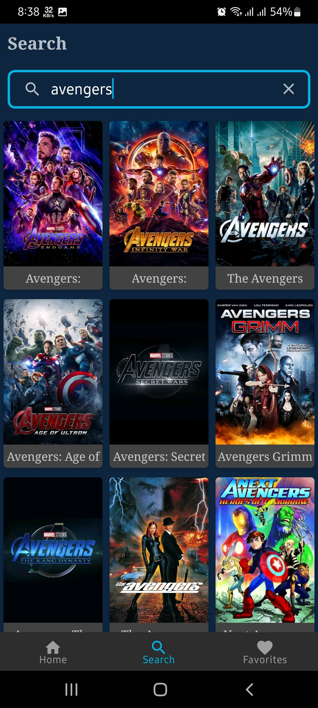
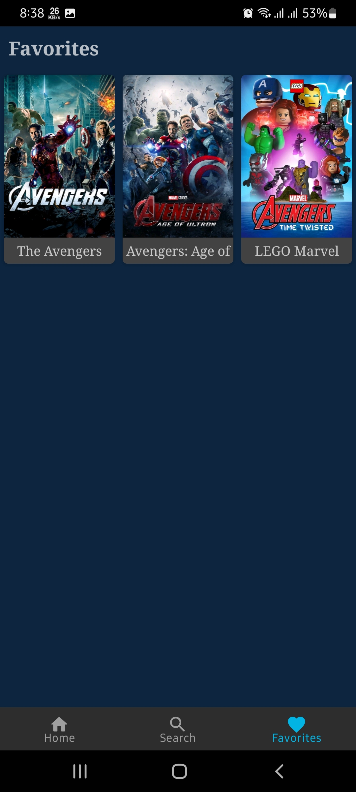

## TMDB Movie Trailer App
Android Base Project for developing Apps  
Android project with Kotlin Coroutines, Flow/LiveData and Jetpack(Room, Retrofit, ViewModel) based on MVVM architecture.

## Tech stack
- Kotlin Coroutines 
- Flow/LiveData for asynchronous data
<!-- - Dagger for dependency injection -->
- Jetpack:
  - Lifecycle
  - ViewModel
  - Room Persistence
- Architecture:
  - MVVM Architecture
- Navigation Component
- ViewBinding
- Retrofit & OkHttp3
- Gson

<!-- 
- Paging 3
- Picasso -->

## Screenshots

